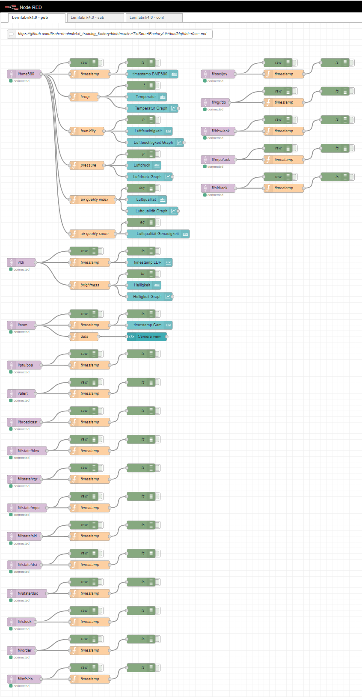
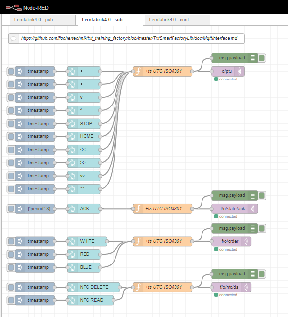
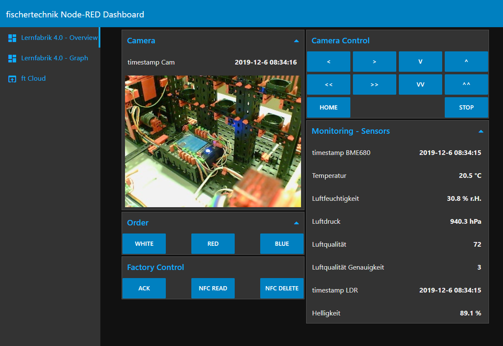
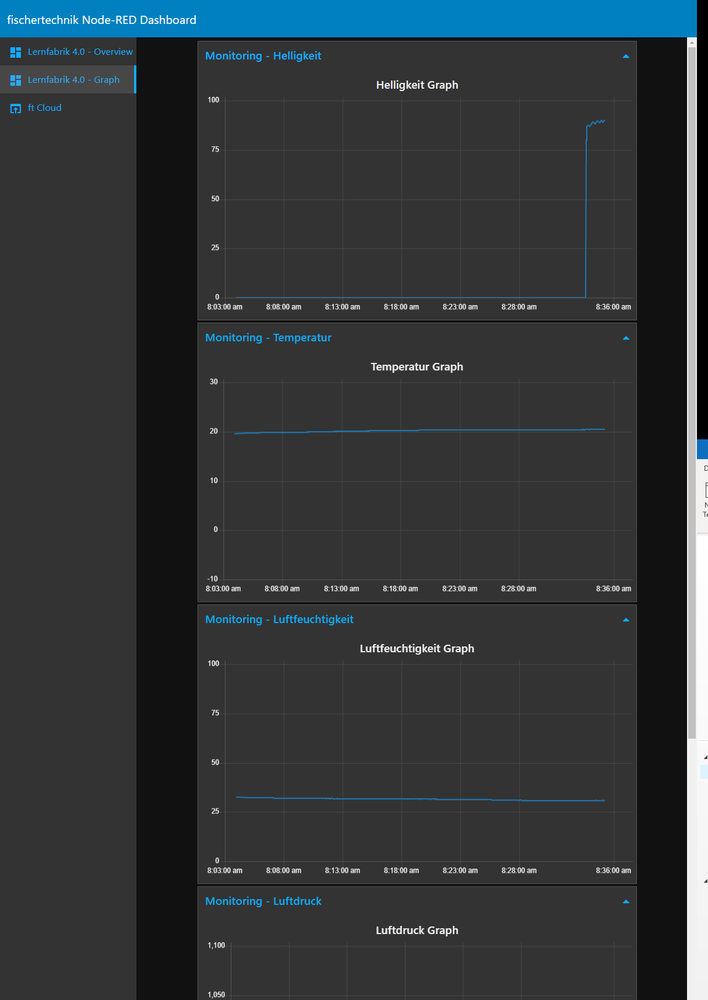

## Node-RED

[Node-RED](https://nodered.org/) is a powerful tool for connecting various hardware and APIs. In addition, you can implement a local dashboard for *Training Factory Industry 4.0* using MQTT nodes in Node-RED.

This example contains simple Node-RED flows, which shows how the *Training Factory Industry 4.0* can be connected to Node-RED.

You can import the [example flows.json file](flows.json) in the Node-RED environment (see [HowTo](https://nodered.org/docs/user-guide/editor/workspace/import-export)).

Node-RED dependencies:
  * [node-red-dashboard](https://flows.nodered.org/node/node-red-dashboard)

### Flows

### Dashboard

