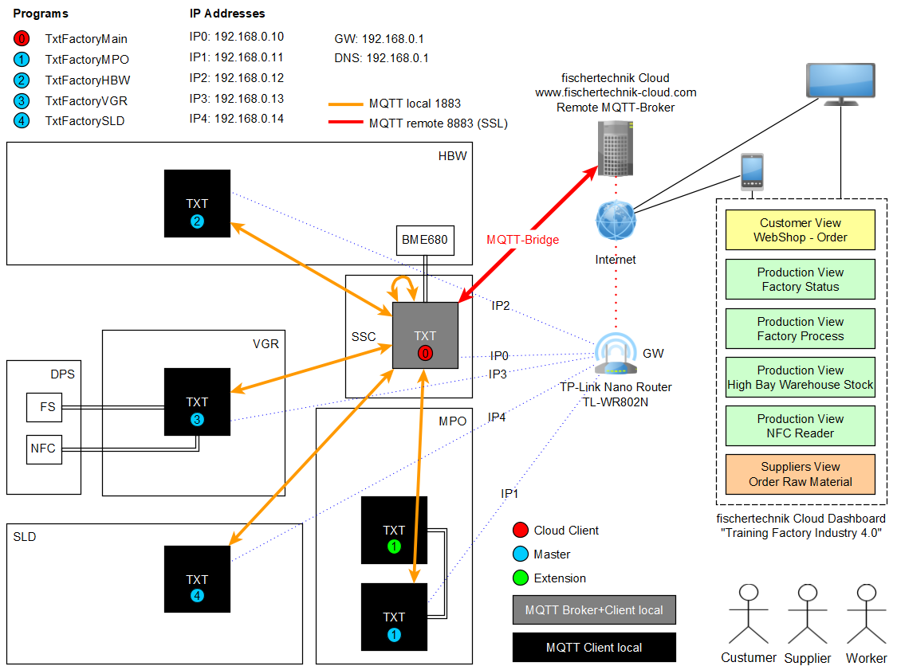

> If you have any questions, please contact fischertechnik-technik@fischer.de

> DEUTSCH: [**fischertechnik Lernfabrik 4.0 (de)**](README_de.md)

# fischertechnik Training Factory Industry 4.0 (en)
This project contains the C/C++ library *TxtSmartFactoryLib* and the main and client programs for the fischertechnik [**Training Factory Industry 4.0**](https://www.fischertechnik.de/en/service/elearning/teaching/lernfabrik-4). The library requires at least the [TXT firmware version 4.5.1](https://github.com/fischertechnik/FT-TXT/releases).

The current txt_training_factory version v0.8.0 ([Release Notes](https://github.com/fischertechnik/txt_training_factory/releases)) requires at least TXT firmware 4.6.6 ([Release Notes](https://github.com/fischertechnik/FT-TXT/releases)). See [HowTo](doc/Factory_Update.md) for more details. An upgrade takes some time and should best be done by an experienced user, because all the data on the TXT controllers will be overwritten.

## Overview
The factory consists of the following stations:
* **SSC**: Sensor Station with Camera (Main)
* **HBW**: High-Bay Warehouse
* **VGR**: Vacuum Gripper Robot
* **DPS**: Delivery and Pickup Station
* **MPO**: Multi-Processing Station with Oven
* **SLD**: Sorting Line with Color Detection

## Programs
The default user programs implement the standard demo scenario with the [www.fischertechnik-cloud.com](https://www.fischertechnik-cloud.com). These programs you will find in the [bin](https://github.com/fischertechnik/txt_training_factory/tree/master/bin) folder:
* **TxtFactoryMain.cloud** (local MQTT broker, MQTT bridge, MQTT client for SSC)
* **TxtFactoryMPO** [[Finite State Machine MPO](https://fischertechnik.github.io/txt_training_factory_doc/html/dot_TxtMultiProcessingStationRun.png)]
* **TxtFactoryHBW** [[Finite State Machine HBW](https://fischertechnik.github.io/txt_training_factory_doc/html/dot_TxtHighBayWarehouseRun.png)]
* **TxtFactoryVGR** [[Finite State Machine VGR](https://fischertechnik.github.io/txt_training_factory_doc/html/dot_TxtVacuumGripperRobotRun.png)] (main flow control)
* **TxtFactorySLD** [[Finite State Machine SLD](https://fischertechnik.github.io/txt_training_factory_doc/html/dot_TxtSortingLineRun.png)]

The programs for the parking position you will find in the [bin](https://github.com/fischertechnik/txt_training_factory/tree/master/bin) folder:
* **TxtParkPosSSC**, **TxtParkPosMPO**, **TxtParkPosHBW**, **TxtParkPosVGR**

The programs can be copied to the TXT controllers using the [WEB server](doc/WEBServer.md).

## Build
You can import the git repository as a workspace in [eclipse CDT](https://www.eclipse.org/cdt/downloads.php) or build the programs with *make*. Please read the [building instructions](doc/IDE_Setup.md). 

## Network
The next picture shows the [network](doc/Network_Config.md) overview with the TXT controllers.

## MQTT Interface
The [MQTT Interface](TxtSmartFactoryLib/doc/MqttInterface.md) describes the topics and the payload of the MQTT clients and the configuration of the mosquitto MQTT bridge. 

## Node-RED
An example for  Training Factory Industry 4.0 and [Node-RED](https://nodered.org/) you can find in [Node-RED folder](Node-RED/README.md). 

## API Reference C/C++ Library
The Doxygen documentation of the C/C ++ library classes can be found in the [API Reference](https://fischertechnik.github.io/txt_training_factory_doc/html/index.html).
