# TXT Local Network Configuration
The master TXT controllers are shipped with already configured wireless settings and are connected to the TP-Link Nano Router TL-WR802N.

If you want to modify the network settings or to use another router you have to setup the WLAN settings on all 5 TXT controllers:
* **TXT0 Main/SSC**: 192.168.0.10
* **TXT1 MPO (master)**: 192.168.0.11
* **TXT2 HBW**: 192.168.0.12
* **TXT3 VGR+DPS**: 192.168.0.13
* **TXT4 SLD**: 192.168.0.14

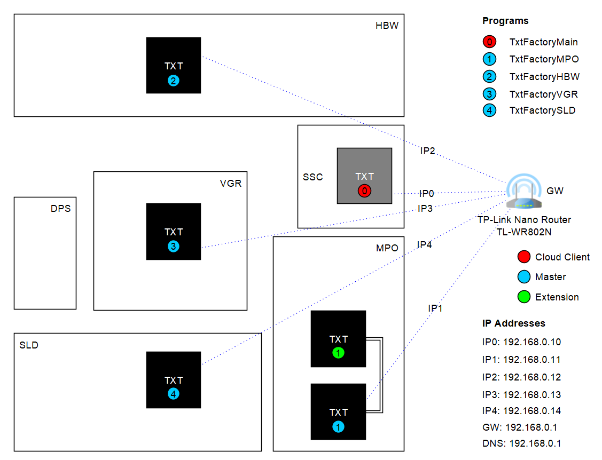

The following screenshots show how to change the wireless settings for all master TXT controllers **TXT0-4**. Repeat configuration for all master TXT controllers.

_:warning: Please replace the IP address 192.168.0.**10** with the corresponding IP address 192.168.0.**1X** of the corresponding master TXT controller!_

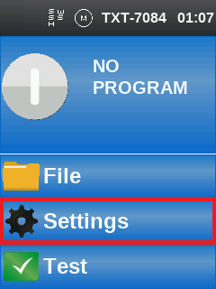 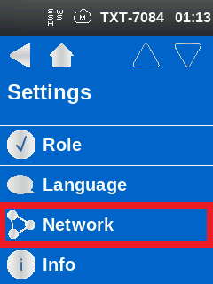 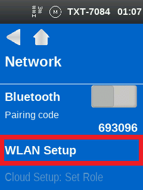 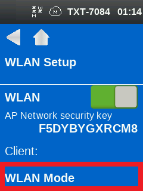 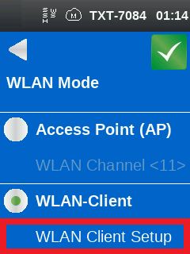 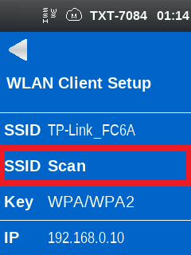 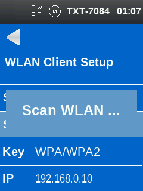 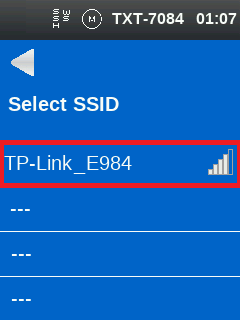 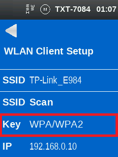 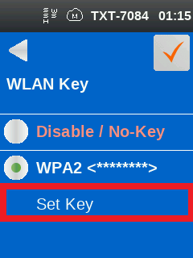 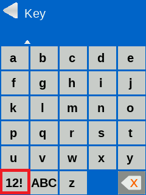 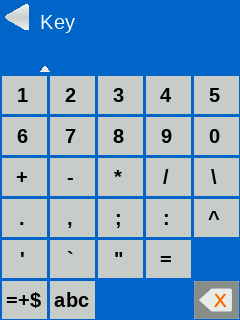 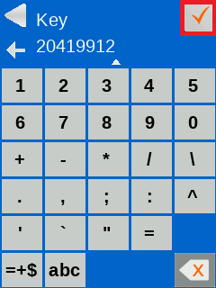 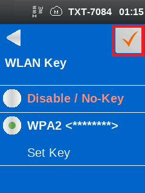 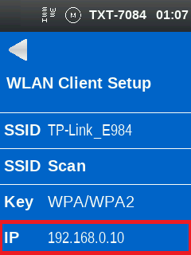 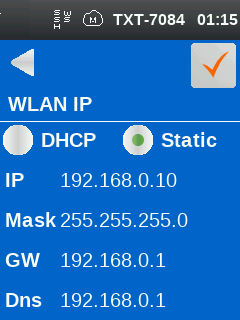 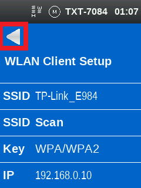 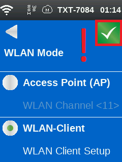 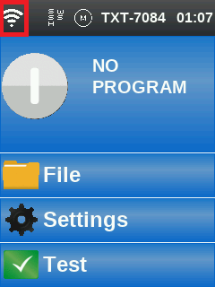
