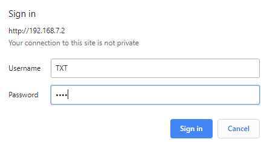

# TXT WEB Server
The TXT controller firmware version> = 4.5.0 contains an integrated WEB server that can be used to upload and download programs and files to the TXT. In this way, e.g. C programs are copied from the computer to the TXT controller and then started via the user interface of the TXT controller.

If the WEB server is not yet switched on, it must first be activated in the TXT menu (*Settings* -> *(down arrow)* -> *Security* -> *WEB Server*). When the WEB server is switched on, a "ws" symbol is displayed in the upper TXT status bar.

    

The TXT controller can be connected to the computer via *USB* / *WLAN* / *Bluetooth*.

The WEB page of the TXT controller can be accessed when the IP address is entered in the WEB browser (*Chrome* or *Firefox* are recommended). Depending on the interface, a different IP address must be entered.

* **USB**: 192.168.7.2
* **WLAN AP**: 192.168.8.2
* **Bluetooth**: 192.168.9.2
* **WLAN Client**: X.X.X.X

The page of the TXT controller is password protected.

* **User**: *TXT*
* **Password**: Four-digit number of the TXT controller displayed in the upper status bar on the TXT display (e.g. *6892* if "TXT-6892" is displayed)

The following query of the password is displayed in the WEB browser:

After entering the password, the page of the TXT controller should now be visible.

To copy C programs to the TXT controller, change to the directory "C-Program" by clicking on it with the mouse. In this directory C programs are stored on the TXT controller.

Files can be deleted using the Recycle Bin icon or added via the **+** icon.

If you click on **+**, a dialog box opens in which you can select files on the computer with "Upload files" and add them with "Add Files". If one or more files have been selected, they are uploaded to the TXT Controller with "Finish".

   

## C Programs - Training Factory Industry 4.0
Current TXT Training Factory Industry 4.0 C programs can be found on [GitHub](https://github.com/fischertechnik/txt_training_factory/tree/master/bin). Save the programs on the computer and download the appropriate C programs to the respective TXT controller as described above. Each TXT controller in TXT Training Factory Industry 4.0 opens its own WEB page. The cloud main application is copied to the "Cloud" folder, the rest of the C programs are copied to the "C-Program" folder.

* **Main**:

 

 

* **MPO**:

 

* **HBW**:

 

* **VGR**:

 

* **SLD**:

 

The C program is automatically loaded at power up when "Auto Load" is enabled. The program is loaded with "Load" as usual with the TXT controller and can then be started via the green button.

If the program is started, the button will change to red. The program can be stopped again with the red button.

 
