# TXT WEB Server
Die TXT Controller Firmware Version >=4.5.0 enthält einen integrierten WEB server, der dazu verwendet werden kann, Programme und Dateien auf den TXT hoch- und runterzuladen. Auf diese Weise können z.B. C-Programme vom Computer auf den TXT Controller kopiert werden und dann über die Benutzeroberfläche des TXT Controllers gestartet werden.

Falls der WEB Server noch nicht eingeschaltet ist, muss dieser zunächst im TXT Menü (*Einstellungen –> (Pfeil nach unten) –> Sicherheit -> WEB Server*) aktiviert werden. Bei eingeschaltetem WEB Server wird in der oberen TXT Statusleiste ein "ws" Symbol angezeigt.

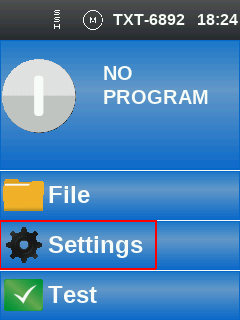 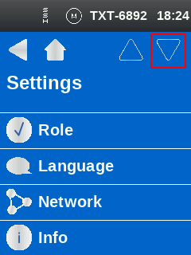 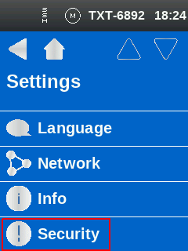 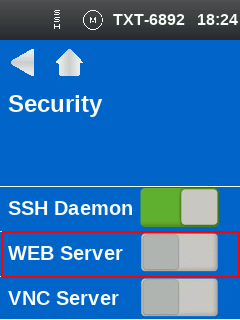 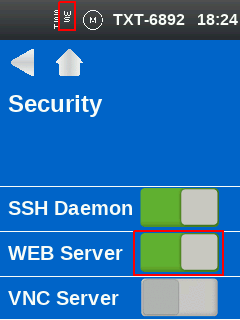

Der TXT Controller wird über *USB / WLAN / Bluetooth* mit dem Computer verbunden.

Die WEB Seite des TXT Controllers kann aufgerufen werden, wenn im WEB Browser (Chrome oder Firefox wird empfohlen) die IP-Adresse eingegeben wird. Dabei muss je nach Schnittstelle eine andere IP-Adresse eingegeben werden.

* **USB**: 192.168.7.2
* **WLAN AP**: 192.168.8.2
* **Bluetooth**: 192.168.9.2
* **WLAN Client**: X.X.X.X

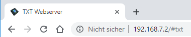

Die Seite des TXT Controllers ist durch ein Passwort gesichert.

* **Benutzer**: *TXT*
* **Passwort**: Vierstellige Nummer des TXT Controllers, die in der oberen    Statusleiste am TXT Display angezeigt wird (z. B. *2427* wenn "TXT-2427" angezeigt wird)

Folgende Abfrage des Passworts wird im WEB Browser angezeigt:

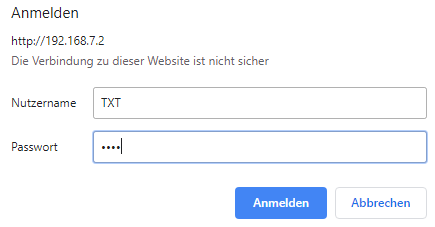
 
Nach Eingabe des Passworts sollte jetzt die Seite des TXT Controllers sichtbar sein.

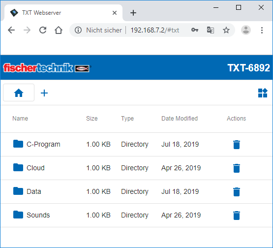

Um C-Programme auf den TXT Controller zu kopieren, wechseln Sie in das Verzeichnis “C-Program”, indem Sie dieses mit der Maus anklicken. In diesem Verzeichnis werden C-Programme auf dem TXT Controller gespeichert.

Dateien können über das Symbol Papierkorb gelöscht oder über das Symbol **+** hinzugefügt werden.

Wenn Sie auf **+** klicken, öffnet sich ein Dialogfenster, in dem Sie mit “Upload files” Dateien auf dem Computer auswählen und mit “Add Files” hinzufügen können. Wenn eine oder mehrere Dateien ausgewählt wurden, werden diese mit "Finish" auf den TXT Controller hochgeladen. 

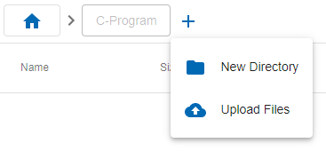 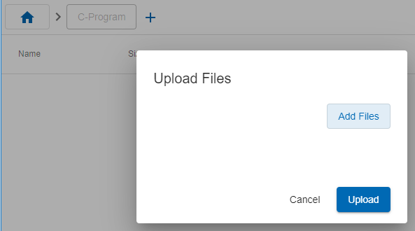 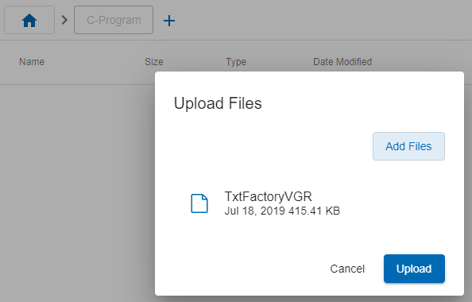 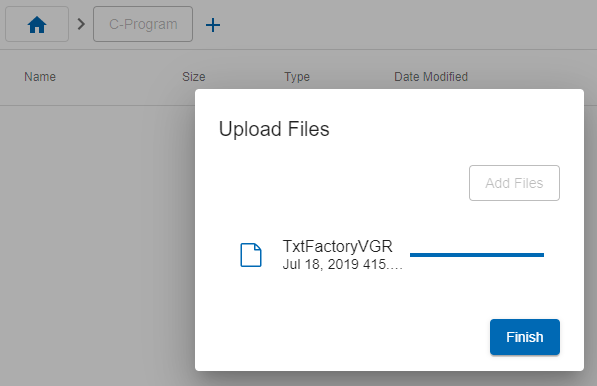

## C-Programme - Lernfabrik 4.0
Aktuelle C-Programme der Lernfabrik 4.0 finden Sie auf [GitHub](https://github.com/fischertechnik/txt_training_factory/tree/master/bin). Speichern Sie die Programme auf dem Computer und laden Sie die entsprechenden C-Programme wie oben bereits beschrieben auf den jeweiligen TXT Controller herunter. Dabei wird pro TXT Controller in der Lernfabrik 4.0 eine eigene WEB Seite geöffnet. Die Cloud-Hauptanwendung wird in den Ordner "Cloud", die restlichen C-Programme werden in den Ordner "C-Program" kopiert.

* **Main**:

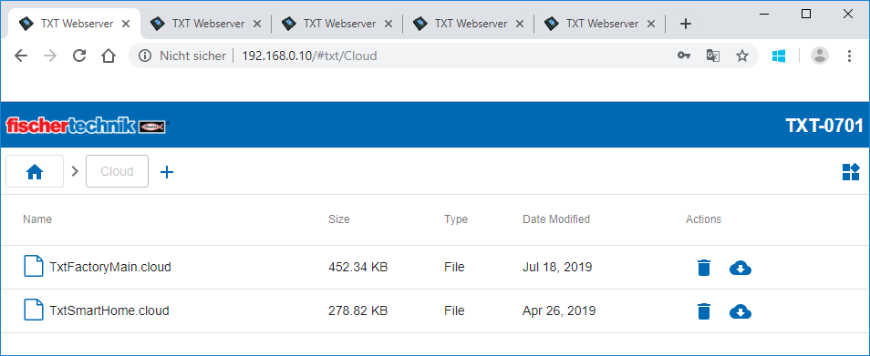 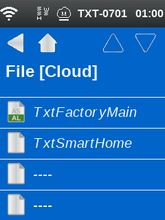

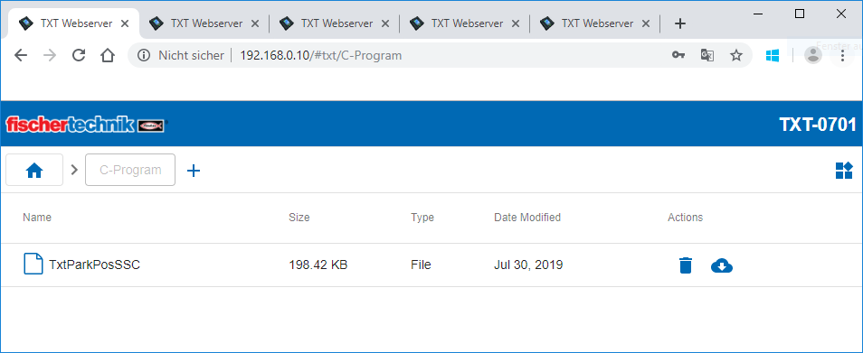 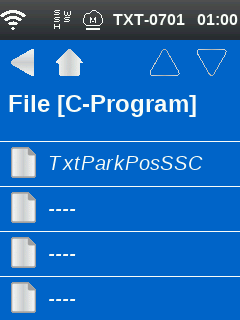

* **MPO**:

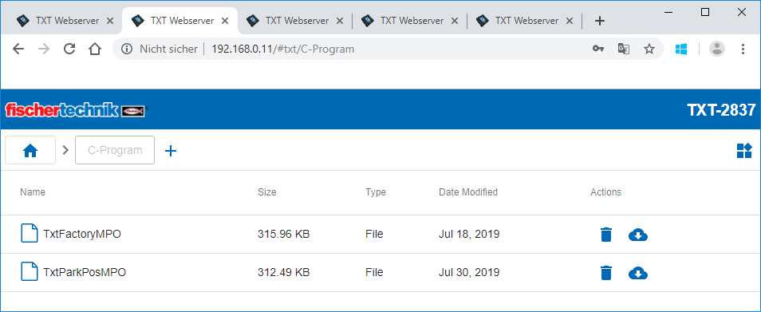 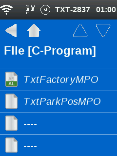

* **HBW**:

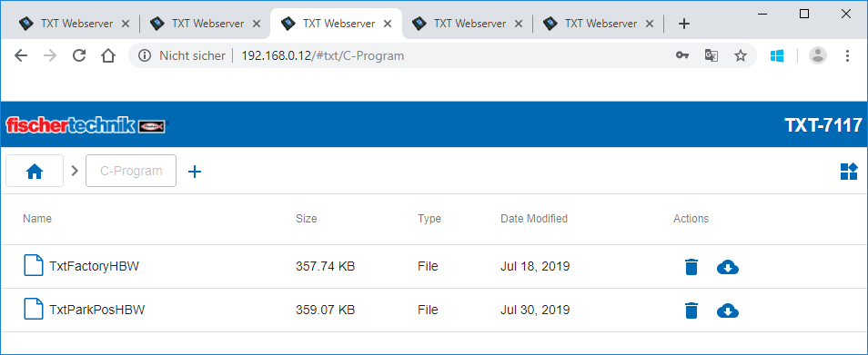 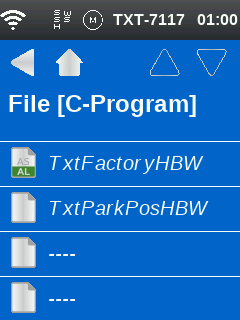

* **VGR**:

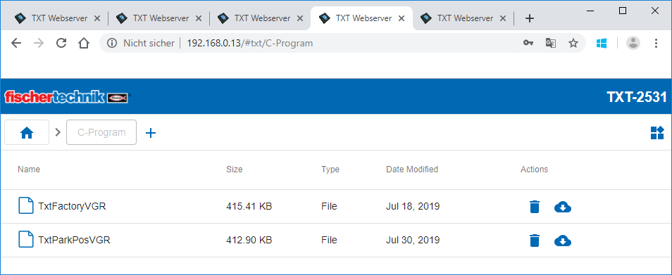 

* **SLD**:

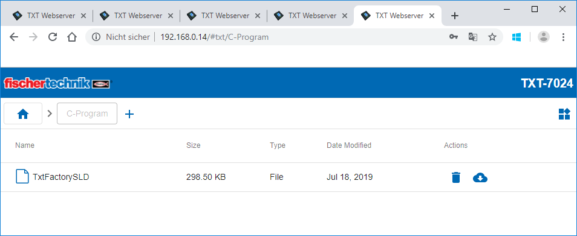 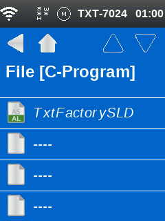

Das C-Programm wird beim Einschalten automatisch geladen, wenn "Auto Load" aktiviert ist. Das Programm wird mit "Load" wie beim TXT Controller üblich geladen und kann dann über den grünen Button gestartet werden.

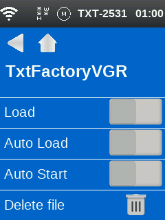
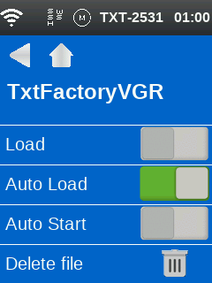
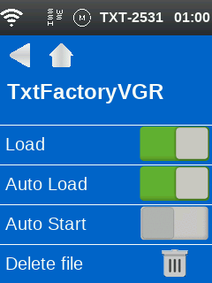

 Wenn das Programm gestartet wurde, so wird der Button rot, mit dem das Programm wieder gestoppt werden kann.
 
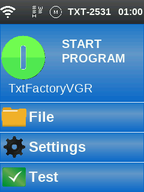 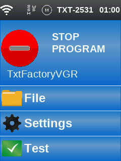
